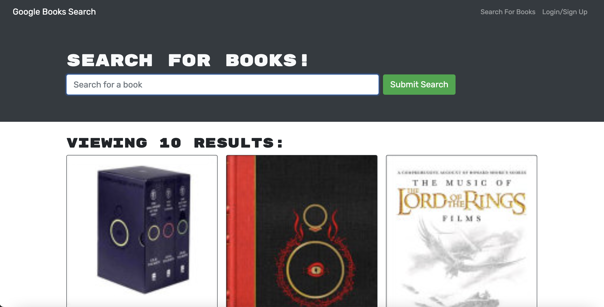

# Module 21 Challenge - MERN-Book-Search

## Description

This week the challenge was to turn a restful API application into one that use Apollo + Graphql.

## Install

Download the files onto your local system and run `npm install`
`npm run build`
`npm run develop`

## Screenshot of deployed application

## Live link to application

Application not working on heroku, receivng this error "code: 'ERR_OSSL_EVP_UNSUPPORTED'" and unable to fix.

